# clase-del-23-de-abril

## Integrantes 
Carlos Stiven Guezguan         Codigo 96039                           
Juan Jose Martinez             Codigo 105353

# Plataforma Quanser

Quanser es una plataforma educativa y de investigación especializada en sistemas de control, robótica y mecatrónica. Se utiliza en universidades y laboratorios para simular y experimentar con sistemas reales mediante hardware y software integrados.

## Características clave
- **Laboratorios virtuales y físicos**: Permite practicar con sistemas como robots, drones o control de motores.
- **Entorno en tiempo real**: Ideal para probar algoritmos de control (PID, automatización, etc.).
- **Aplicaciones**: Desde docencia hasta prototipado industrial.

## Primeros pasos

Para iniciar correctamente el entorno de Quanser QLabs en MATLAB, se debe seguir una secuencia estándar de funciones que garantiza la configuración, registro e inicio de los procesos necesarios. A continuación, se describen las funciones empleadas en este procedimiento:

QLabs.setup

Esta función tiene como objetivo preparar el entorno de trabajo de QLabs. Su ejecución inicializa los componentes esenciales para el funcionamiento del sistema. Entre sus tareas principales se encuentran:
Establecimiento de conexiones con dispositivos físicos o servidores remotos.

- Carga de bibliotecas necesarias y parámetros de configuración predeterminados.
- Preparación general del sistema para la ejecución de simulaciones o experimentos.

QLabs.register

Una vez preparado el entorno, esta función permite registrar entidades dentro del sistema QLabs, posibilitando su posterior identificación y administración. Sus aplicaciones comunes incluyen:

Autenticación de usuarios, dispositivos o componentes experimentales.
Configuración de perfiles experimentales personalizados.
Asignación de recursos y permisos específicos dentro del entorno QLabs.

QLabs.launch

Finalmente, esta función se encarga de iniciar los procesos principales dentro de QLabs. Sus operaciones pueden incluir:

Ejecución de simulaciones o experimentos físicos o virtuales.
Lanzamiento de interfaces gráficas de usuario.
Puesta en marcha de servicios o procesos en segundo plano necesarios para la operación del sistema.

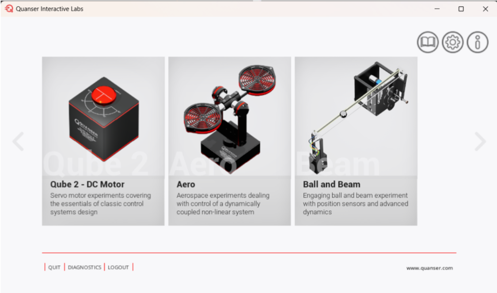

## Menú principal de QLabs

Quanser QLabs es una plataforma de laboratorios virtuales diseñada para facilitar la enseñanza y experimentación en control y robótica de manera interactiva. Su menú principal presenta diversas opciones de experimentos que cubren distintos aspectos de la teoría de control, desde sistemas clásicos hasta dinámicas no lineales. A continuación, se describen los principales módulos disponibles:

1. Qube 2 – DC Motor

Enfoque: Control clásico de sistemas lineales.

Aplicación: Este módulo está orientado al aprendizaje de fundamentos de control automático, como el diseño y ajuste de controladores PID. Utiliza un motor de corriente continua (DC) con sensores de posición y velocidad, lo que permite realizar prácticas de identificación de sistemas, modelado dinámico y diseño de lazo cerrado.

2. Aero

Enfoque: Sistemas aeroespaciales dinámicamente acoplados y no lineales.

Aplicación: Simula una plataforma similar a un dron o helicóptero, permitiendo el estudio del comportamiento dinámico en múltiples grados de libertad. Este experimento es ideal para explorar conceptos avanzados como el control multivariable, la estabilidad de sistemas acoplados y la linealización de sistemas no lineales.

3. Ball and Beam

Enfoque: Dinámica no lineal y control en tiempo real.

Aplicación: Este módulo representa el clásico sistema bola-viga, donde se busca mantener la bola en una posición deseada controlando el ángulo de inclinación de la viga. Es un ejemplo representativo de sistemas inestables de segundo orden, ampliamente utilizado para la enseñanza de técnicas de control robusto y diseño de observadores.

**Características Principales
Componentes principales:**

- Motor DC con encoder de alta precisión.
- Disco de inercia ajustable para modificar la dinámica del sistema.
- Tarjeta de adquisición de datos integrada.

**Parámetros clave:**

- Voltaje nominal: 12V.
- Rango de velocidad: 0–3000 RPM.
- Resolución del encoder: 2048 pulsos por revolución.

 **Software compatible:**
 
- MATLAB/Simulink (via QUARC).
- LabVIEW.
- Python (con librerías de Quanser).

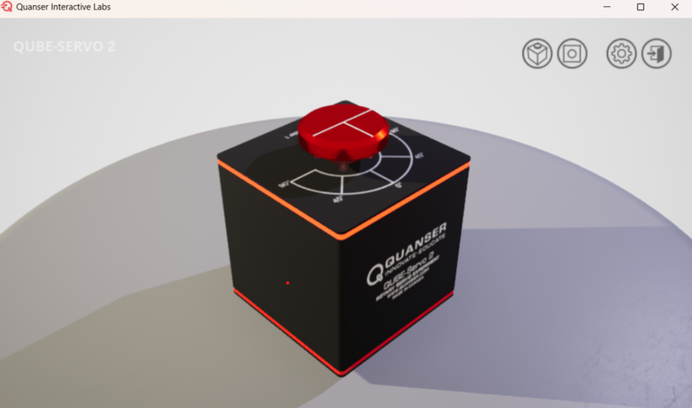

**Diferencias entre Qube-Servo 2 y Qube 3**

Aunque inicialmente se planificó el desarrollo del proyecto utilizando el Qube-Servo 2, basándonos en las simulaciones disponibles en Quanser QLabs, el equipo físico disponible en el laboratorio de la universidad corresponde al Qube 3. Afortunadamente, las diferencias entre ambos modelos son mínimas en términos de estructura funcional y principios de operación, lo que permite realizar la transición sin mayores inconvenientes.

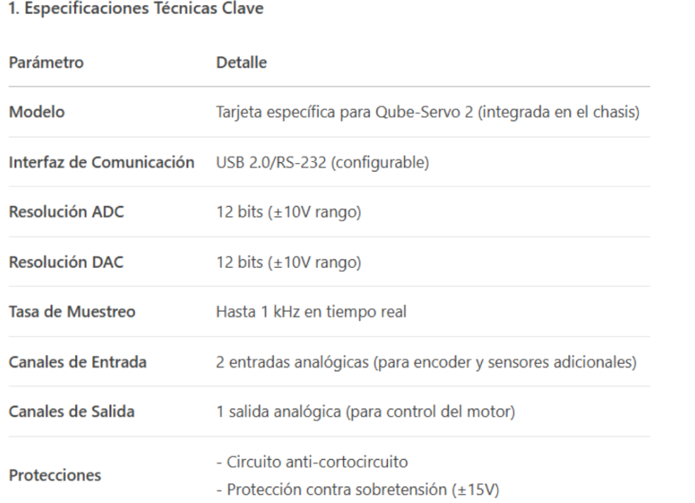

Los motores DC servo incorporados en el Qube-Servo 2 de Quanser se caracterizan por su alta precisión, robustez estructural y calidad de fabricación, cualidades que los hacen especialmente adecuados para su uso en entornos académicos y de investigación. Gracias a estas propiedades, ofrecen un comportamiento dinámico confiable y una respuesta consistente, esenciales para la enseñanza y validación de sistemas de control en lazo cerrado.

Adicionalmente, el Qube-Servo 2 y otros sistemas desarrollados por Quanser han sido diseñados para integrarse de forma óptima con Simulink, el entorno gráfico de simulación y modelado de sistemas de MATLAB. Esta integración proporciona a estudiantes e investigadores una plataforma versátil y profesional para el desarrollo de algoritmos de control.

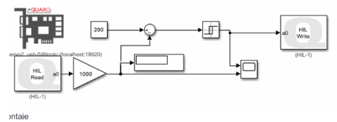

La respuesta de la corriente del motor ante una señal de referencia o cambio en la entrada del sistema. Esta curva permite analizar la dinámica del lazo interno de corriente, evaluando aspectos como el tiempo de establecimiento, sobreimpulso y capacidad de seguimiento. Un buen desempeño en esta curva indica que el controlador de corriente está adecuadamente ajustado para responder de forma rápida y estable a las demandas del sistema de control de velocidad.
 
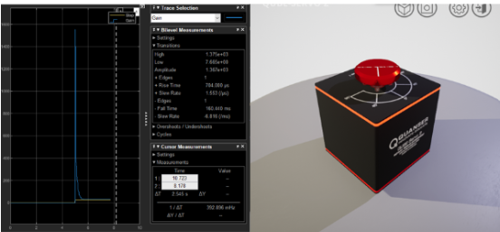

La respuesta dinámica de la velocidad del motor frente a una señal de referencia. Esta curva permite evaluar el desempeño del lazo externo de control de velocidad, observando características como el tiempo de respuesta, seguimiento de la referencia y la suavidad de la transición. Un seguimiento preciso indica una buena sintonización del controlador PI y una adecuada interacción con el lazo interno de corriente.

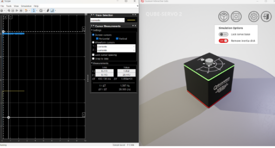

La imagen muestra la disposición típica del sistema QUBE-Servo, incluyendo la conexión entre el hardware físico y el entorno de desarrollo en MATLAB/Simulink. En esta configuración, el QUBE-Servo se conecta al computador a través de una interfaz USB, permitiendo la comunicación en tiempo real mediante la plataforma QUARC de Quanser. Esta configuración es utilizada para ejecutar algoritmos de control directamente sobre el sistema físico, así como para adquirir datos experimentales con fines de análisis, ajuste y validación de modelos dinámicos.

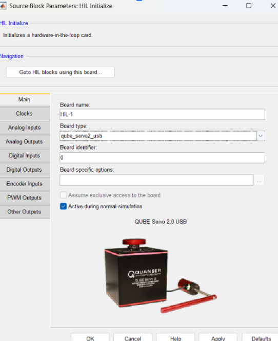

En la imagen se muestra la configuración del tiempo de muestreo en el entorno de Simulink, utilizada para ejecutar algoritmos de control en el sistema QUBE-Servo. Este parámetro se define dentro del modelo como un valor de paso fijo (Fixed-step size), el cual determina cada cuánto tiempo se actualiza el sistema durante la simulación o ejecución en tiempo real.

Establecer un tiempo de muestreo adecuado es fundamental para garantizar la estabilidad y precisión del controlador, así como para evitar problemas de aliasing o sobrecarga computacional. En este ejemplo, se ha configurado un valor de 0.002 segundos (2 ms), el cual es comúnmente utilizado para aplicaciones de control rápido como el posicionamiento de motores DC servo.

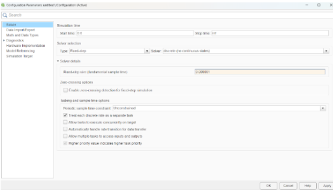

**Ejemplo 1**

El diagrama muestra un sistema de control en cascada diseñado para que la velocidad de un motor siga una referencia de 1000 unidades. El sistema compara la velocidad deseada con la real y genera un error que pasa a un controlador PI, el cual calcula la corriente necesaria para alcanzar la velocidad objetivo. Esta corriente deseada se compara con la real, y otro controlador regula la entrada al motor para ajustar la corriente. Así, mediante este doble lazo de control (uno externo de velocidad y uno interno de corriente), el sistema logra que la salida (velocidad) siga de forma precisa a la señal de referencia, lo que significa que "está siguiendo al seguidor

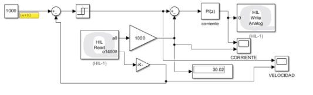

La gráfica se visualiza que la respuesta del sistema (línea azul) sigue correctamente a la referencia (línea amarilla), lo que confirma que el controlador diseñado está funcionando adecuadamente: la salida (velocidad angular o posición) alcanza y mantiene el valor deseado sin error aparente. Además, en la simulación se indica que el sistema está operando con el "Load servo base", sin la inercia removible. Esto significa que las condiciones del modelo físico son estándar, lo cual es importante para evaluar la estabilidad y el rendimiento del controlador en condiciones nominales.

**Ejemplo 2**

El diagrama muestra un sistema de control en lazo cerrado para el QUBE-Servo 2 implementado en Simulink, donde se regula la posición del motor utilizando un controlador PI digital. La posición deseada se compara con la medida real obtenida del hardware a través de HIL (Hardware-in-the-Loop), y el error resultante alimenta al controlador, que genera la señal de control enviada al actuador mediante una salida analógica. El sistema también mide corriente, velocidad y posición del motor, que son retroalimentadas y visualizadas para monitorear el comportamiento del sistema en tiempo real. Esto permite que el motor siga con precisión la referencia de posición establecida.

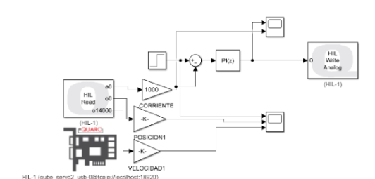

La gráfica de la respuesta en velocidad del sistema QUBE-Servo 2 a una entrada escalón, donde se observa que la curva (en color naranja) sigue una forma típicamente exponencial creciente hasta estabilizarse cerca del valor de referencia (línea amarilla). Esto indica que el sistema presenta un comportamiento estable, con un buen seguimiento de la referencia y sin sobrepaso significativo. El tiempo de establecimiento es de aproximadamente 1.87 segundos, con una frecuencia de muestreo de 1.75 kHz, lo que sugiere que el controlador PI implementado está correctamente sintonizado para alcanzar el valor deseado con rapidez y precisión. 

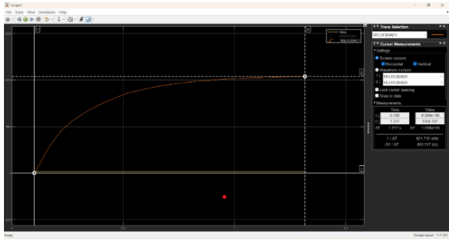
